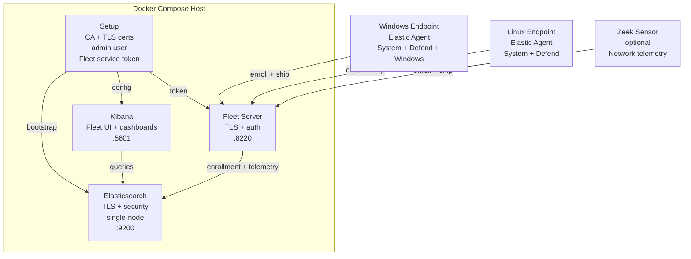

<div align="center">

# Elastic Security Infrastructure

<p>
  A containerized Elastic SIEM/EDR deployment framework for automated,<br/>
  TLS-secured infrastructure, Fleet orchestration, telemetry collection,<br/>
  and ATT&CK-aligned detection.
</p>

[](LICENSE)
[](https://www.elastic.co)
[](https://www.docker.com)
[](https://www.gnu.org/software/bash/)

**[Quick Start](#quick-start)** · **[Configuration](#configuration)** · **[Architecture](#architecture)** · **[Endpoint Enrollment](#endpoint-enrollment)** · **[Operations](#operations)** · **[Deployment Guide](ELASTIC-SECURITY-DEPLOYMENT-GUIDE.md)**

</div>

## Overview

Building a functional SIEM/EDR platform from scratch requires coordinating TLS certificate generation, Elasticsearch security configuration, Fleet Server enrollment, agent policy creation, integration packaging, and detection-rule deployment — all of which must interoperate correctly before a single endpoint can report telemetry.

This repository automates the core Elastic deployment and configuration process. A single `./elastic-container.sh start` provisions a fully TLS-secured Elastic stack with pre-configured Fleet policies for Windows, Linux, and baseline endpoints, installs Elastic Defend with EDRComplete telemetry, deploys prebuilt MITRE ATT&CK-aligned detection rules, and configures Fleet output — all from environment variables with no hardcoded IPs or credentials in code.

The framework is designed for security practitioners, researchers, and lab/homelab environments that need a repeatable Elastic SIEM/EDR foundation without manually configuring the entire stack.

## Key Capabilities

- **Automated Elastic stack deployment** — Elasticsearch, Kibana, and Fleet Server provisioned via Docker Compose with a single command
- **TLS/PKI automation** — CA and per-service certificate generation with parameterized SANs; certificate isolation per service
- **Fleet policy orchestration** — idempotent creation of OS-specific agent policies (Windows, Linux, Baseline) with correct integrations pre-attached
- **Elastic Defend EDR** — EDRComplete preset deployed on all endpoint policies with process, file, network, registry, and security-event telemetry
- **Prebuilt detection rules** — bulk-enabled by OS (Windows, Linux, macOS) at first start via `.env` flags
- **Parameterized networking** — all addressing driven from `.env`; supports NAT/management IPs and static IP configuration
- **Security hardening** — password policy enforcement, credential isolation, TLS verification, destructive-action confirmation, and action audit logging
- **Preflight validation** — prerequisite checks for Docker, tools, configuration, ports, disk, and memory before deployment
- **Zeek integration** — optional Fleet-managed Zeek sensor support for network telemetry ingestion
- **Operational safeguards** — `destroy` and `clear` require explicit typed confirmation; all administrative actions are logged

## Architecture



## Components

**Containers:**

| Component | Container Name | Purpose |
|---|---|---|
| Elasticsearch | `ecp-elasticsearch` | Data store, search engine, security configuration, detection engine |
| Kibana | `ecp-kibana` | Web UI, Fleet management, dashboards, detection rules |
| Fleet Server | `ecp-fleet-server` | Agent enrollment, policy distribution, telemetry routing |
| Security Setup | `ecp-elasticsearch-security-setup` | One-time init: CA, TLS certs, admin user, Fleet service token |

**Scripts:**

| Script | Purpose |
|---|---|
| `elastic-container.sh` | Main orchestration script (start, stop, destroy, Fleet setup, detection rules) |
| `fleet-entrypoint.sh` | Fleet Server entrypoint; detects existing enrollment to prevent duplicate agents |
| `set-static-ip.sh` | Optional: configure a static IP on the agent-facing network interface |

## Fleet Policies

`./elastic-container.sh start` idempotently creates and wires these Agent Policies (existing policies are reused, never duplicated):

| Policy | Integrations | Intended For |
|---|---|---|
| `Fleet-Server-Policy` | Fleet Server | The Fleet Server container itself |
| `Windows Endpoint` | System + Elastic Defend + Windows | Windows hosts (Security log, Sysmon, PowerShell, Defender) |
| `Linux Endpoint` | System + Elastic Defend | Linux hosts (metrics + EDR; syslog/auth if rsyslog present) |
| `Endpoint Baseline` | System + Elastic Defend | Any OS, EDR-only baseline |
| `Zeek` | System + Zeek | Zeek sensor host (only when `ZEEK_ENABLED=1`) |

The **System** integration is auto-added via `sys_monitoring=true` and covers host metrics everywhere. The **Windows** integration is added **only** to `Windows Endpoint` so Linux policies never receive winlog channels.

## Telemetry

### Windows

The **Windows Endpoint** policy collects:

| Data Source | Data Stream | Prerequisite |
|---|---|---|
| Windows Application/Security/System logs | `logs-system.application/security/system-*` | System integration (automatic) |
| System metrics (CPU, memory, disk) | `metrics-system.*` | System integration (automatic) |
| Sysmon events | `logs-windows.sysmon_operational-*` | Sysmon installed and running on host |
| PowerShell Operational (4103-4108) | `logs-windows.powershell_operational-*` | Script Block Logging enabled on host |
| Windows Defender events | `logs-windows.windows_defender-*` | Defender active on host |
| Classic PowerShell (400,403,600,800) | `logs-windows.powershell-*` | Enabled by default |
| Process/File/Network/Registry events | `logs-endpoint.events.*` | Elastic Defend (automatic) |
| Malware protection alerts | `logs-endpoint.alerts-*` | Elastic Defend (automatic) |

### Linux

The **Linux Endpoint** policy collects:

| Data Source | Data Stream | Prerequisite |
|---|---|---|
| System metrics | `metrics-system.*` | System integration (automatic) |
| Auth/syslog logs | `logs-system.auth/syslog-*` | rsyslog installed, or journald input configured |
| Process/File/Network events | `logs-endpoint.events.*` | Elastic Defend (automatic) |

### macOS

macOS agents enroll into the **Endpoint Baseline** policy (System + Elastic Defend). Follow the same CA trust and enrollment flow as Linux.

### Zeek (optional)

When `ZEEK_ENABLED=1`, the start script creates a `Zeek` Fleet policy configured to ingest JSON logs from `ZEEK_LOG_DIR`:

| Log | Data Stream |
|---|---|
| conn.log | `logs-zeek.connection` |
| dns.log | `logs-zeek.dns` |
| http.log | `logs-zeek.http` |
| ssl.log | `logs-zeek.ssl` |
| files.log | `logs-zeek.files` |
| ssh.log | `logs-zeek.ssh` |
| weird.log | `logs-zeek.weird` |

## Detection

The repository installs Elastic's prebuilt detection rules on start and can bulk-enable them per OS via `.env` flags:

| Flag | Effect |
|---|---|
| `WindowsDR=1` | Enables rules tagged `Windows` or `OS: Windows` |
| `LinuxDR=1` | Enables rules tagged `Linux` or `OS: Linux` |
| `MacOSDR=1` | Enables rules tagged `macOS` or `OS: macOS` |

Detection rules consume telemetry — they do not collect it. The pipeline is:

```
Integration (on agent policy) -> Agent collects data -> Data stream in Elasticsearch -> Detection rule queries data -> Alert
```

Rules requiring specific host-side configuration (Sysmon, PowerShell Script Block Logging, Windows audit policy) remain dormant until the prerequisite telemetry is flowing. Enabling a rule without its corresponding telemetry pipeline means the rule will never fire.

## Security Hardening

| Area | Implementation |
|---|---|
| **TLS everywhere** | Elasticsearch (9200/9300), Kibana (5601), Fleet Server (8220) all use TLS with a private CA |
| **Certificate isolation** | Each service receives only its own cert/key and the CA public cert; no cross-service key access |
| **Password policy** | Minimum 12 characters; rejects `changeme`, `password`, `elastic`, and unsafe characters ($, backtick, quotes, backslash) |
| **Credential protection** | `.env` set to `0600`; API calls use ephemeral netrc files (no credentials in process args); `curl -k` never used |
| **Config validation** | IP addresses, ports, CIDR prefix, interface names, usernames, and version tags strictly validated before interpolation |
| **Destructive safety** | `destroy` and `clear` require typing `DESTROY` / `CLEAR` (all uppercase) to confirm; accidental execution aborts |
| **Action audit trail** | `start`, `destroy`, and `clear` append timestamped entries to `.logs/actions.log` (gitignored) |
| **Fleet auth isolation** | Fleet Server authenticates via a dedicated service token (least-privilege), not the `elastic` superuser |
| **Preflight checks** | Validates Docker, tools, `.env`, password policy, network interfaces, ports, disk space, and memory before deployment |

## Prerequisites

**Linux (Ubuntu/Debian):**

```bash
sudo apt update
sudo apt install -y docker.io docker-compose-plugin jq curl git
sudo usermod -aG docker "$USER"
newgrp docker
```

**macOS:**

```bash
brew install jq git curl docker-compose
brew install --cask docker
```

- `docker-compose-plugin` is required (not the legacy `docker-compose`)
- Docker must have privileged access (follow Docker Desktop prompts on macOS)

## Quick Start

```bash
# 1. Clone and enter the repository
git clone https://github.com/KhanFaiz5426/elastic-security-infrastructure.git elastic-security-infrastructure
cd elastic-security-infrastructure

# 2. Create your configuration
cp .env.example .env
openssl rand -hex 32                        # generate an encryption key

# 3. Edit .env — set at minimum:
#    SIEM_IP, ELASTIC_PASSWORD, KIBANA_PASSWORD, KIBANA_ENCRYPTION_KEY
nano .env

# 4. (Optional) Run preflight checks
./elastic-container.sh preflight

# 5. Start the stack
./elastic-container.sh start

# 6. Verify
./elastic-container.sh status
curl -sk https://127.0.0.1:8220/api/status
```

Browse to `https://<SIEM_IP>:5601` and log in with `${ELASTIC_USERNAME}` (default `elastic`) / your password.

> For the complete deployment walkthrough including endpoint enrollment, telemetry verification, and clean rebuild procedures, see [ELASTIC-SECURITY-DEPLOYMENT-GUIDE.md](ELASTIC-SECURITY-DEPLOYMENT-GUIDE.md).

## Configuration

All configuration is driven by the `.env` file. No IPs or credentials are hardcoded in scripts or Docker Compose.

| Variable | Required | Default | Purpose |
|---|---|---|---|
| `SIEM_IP` | **Yes** | — | Primary IP for TLS SANs, Fleet Server URL, ES output URL |
| `SIEM_NAT_IP` | No | — | Additional NAT/management IP added to cert SANs |
| `SIEM_IFACE` | No | — | Network interface name for static IP setup |
| `SIEM_PREFIX` | No | `24` | CIDR prefix for the agent-facing interface |
| `ELASTIC_USERNAME` | No | `elastic` | Admin superuser for Kibana login + API |
| `ELASTIC_PASSWORD` | **Yes** | — | Password for the admin user (min 12 chars) |
| `KIBANA_USERNAME` | No | `kibana_system` | Internal Kibana-to-Elasticsearch user |
| `KIBANA_PASSWORD` | **Yes** | — | Password for `KIBANA_USERNAME` (min 12 chars) |
| `KIBANA_ENCRYPTION_KEY` | **Yes** | — | Random key for saved-object encryption; generate with `openssl rand -hex 32` |
| `STACK_VERSION` | No | `9.5.0` | Elastic image tag (Elasticsearch + Kibana + Agent) |
| `WindowsDR` | No | `1` | Enable Windows detection rules at first start |
| `LinuxDR` | No | `0` | Enable Linux detection rules at first start |
| `MacOSDR` | No | `0` | Enable macOS detection rules at first start |
| `ZEEK_ENABLED` | No | `0` | Set to `1` to create Zeek Fleet policy + integration |
| `ZEEK_LOG_DIR` | No | `/opt/zeek/logs/current` | Zeek JSON log directory on the sensor host |
| `LICENSE` | No | `basic` | `basic` (free) or `trial` (30-day full features) |

> **Important:** If you change `SIEM_IP` or `SIEM_NAT_IP` after first boot, you must run `destroy` + `start` to regenerate certificates with the new IPs in the SANs.

## Endpoint Enrollment

### Windows

1. Import the SIEM CA into `LocalMachine\Root` on the Windows host (see [Deployment Guide, Phase 6](ELASTIC-SECURITY-DEPLOYMENT-GUIDE.md#phase-6--deploy-windows-endpoint-agent) for methods)
2. In Kibana: **Fleet > Agents > Add agent** — select the **Windows Endpoint** policy
3. Download, extract, and install the Elastic Agent matching your `STACK_VERSION`
4. Confirm in Kibana: **Fleet > Agents** shows the host as **Healthy**

### Linux

1. Trust the SIEM CA in the system store or pass `--certificate-authorities` at install time
2. Download the agent matching `STACK_VERSION`, then install with the **Linux Endpoint** enrollment token:

```bash
sudo ./elastic-agent install \
  --url="https://<SIEM_IP>:8220" \
  --enrollment-token="<token>" \
  --certificate-authorities=/path/to/ca.crt
```

3. Verify: `systemctl status elastic-agent` shows active; host appears **Healthy** in Fleet

### macOS

Same flow as Linux — trust the CA in the system keychain, use the appropriate architecture agent (`darwin-aarch64` or `darwin-x86_64`), and enroll with the **Endpoint Baseline** token. See [Deployment Guide, Phase 7](ELASTIC-SECURITY-DEPLOYMENT-GUIDE.md#phase-7--deploy-linux--macos-endpoint-agents).

## Operations

| Command | Effect |
|---|---|
| `./elastic-container.sh start` | Run preflight, create network, pull images, start + configure stack |
| `./elastic-container.sh stop` | Stop containers (preserves state) |
| `./elastic-container.sh restart` | Restart all stack containers |
| `./elastic-container.sh status` | Show container status |
| `./elastic-container.sh preflight` | Run read-only deployment prerequisite checks |
| `./elastic-container.sh clear` | Delete all documents in `logs-*` and `metrics-*` data streams |
| `./elastic-container.sh destroy` | Remove containers, network, and all volumes (permanent data loss) |
| `./elastic-container.sh stage` | Pre-pull images without starting |
| `./elastic-container.sh update-version` | Refresh `STACK_VERSION` to the newest stable tag from Docker Hub |

## Troubleshooting

| Symptom | Cause / Fix |
|---|---|
| Agent shows **Unhealthy/Degraded** right after start | Transient; fleet-server monitoring outputs briefly flip at boot. Recheck in 30-60s. |
| `x509: cannot validate certificate ... IP SANs` | Cert lacks the IP you connected to. Set `SIEM_IP`/`SIEM_NAT_IP` correctly, then `destroy` + `start`. |
| `x509: certificate signed by unknown authority` | Host doesn't trust the stack CA — import `ca.crt` into the system trust store. |
| Healthy agent but no data | Check agent's last check-in in **Fleet > Agents**; verify `SIEM_IP` and ES output in **Fleet > Settings**. |
| 401 / `unable to authenticate user [elastic]` | `.env` password changed after first boot. Use ES Change Password API or `destroy` + `start`. |
| Linux: no `system.auth`/`system.syslog` | Host has no rsyslog. Install rsyslog or configure a journald input in Fleet UI. |
| `host.name: "WIN-..."` returns 0 hits | Windows docs store `host.name` lowercased (`win-...`). Query the lowercase value. |
| ES/Kibana ports unreachable from another host | Confirm both hosts are on the same network and firewalls allow the configured ports. |

> For complete troubleshooting including agent enrollment failures, Sysmon configuration, PowerShell logging, Windows audit policy, and telemetry verification, see [ELASTIC-SECURITY-DEPLOYMENT-GUIDE.md](ELASTIC-SECURITY-DEPLOYMENT-GUIDE.md).

## Automation Boundary

### Automated by this repository

| Task | Condition |
|---|---|
| Elasticsearch, Kibana, Fleet Server deployment | Always |
| TLS certificate generation and service isolation | Always |
| Fleet output configuration (URL, CA fingerprint, TLS mode) | Always |
| Fleet agent policy creation (Windows, Linux, Baseline) | First start |
| Elastic Defend integration (EDRComplete) on all endpoint policies | First start |
| Windows integration (Sysmon/PowerShell/Defender winlog channels) | First start, Windows Endpoint policy only |
| Detection rule installation and bulk enablement | Per `WindowsDR`/`LinuxDR`/`MacOSDR` |
| Zeek Fleet policy + integration | `ZEEK_ENABLED=1` |

### Operator-controlled

| Task | Responsible Party |
|---|---|
| Sysmon installation and configuration | Windows endpoint administrator |
| PowerShell Script Block Logging enablement | Windows endpoint administrator |
| Windows Advanced Audit Policy (GPO) | AD/domain administrator |
| Linux rsyslog/journald configuration | Linux endpoint administrator |
| Zeek installation, configuration, and network visibility | Network operator / Network team |
| SPAN/TAP/mirror configuration | Network team |
| Firewall rules for agent communication | Network/security team |
| Velociraptor server/client deployment | DFIR team — external to this repository |

### Outside this repository

- Enterprise network architecture and routing
- Velociraptor deployment and configuration
- Physical/virtual network infrastructure
- Organizational change management and authorization

## Scope and Limitations

This repository provides a functional SIEM/EDR foundation. The following are **not** currently implemented:

- SOAR (Security Orchestration, Automation, and Response)
- Fully automated incident response or endpoint isolation
- Automatic firewall response to alerts
- Velociraptor orchestration or automated DFIR
- Custom threat-hunting interface
- Multi-node Elasticsearch cluster deployment
- Snapshot/backup automation
- Role-based access control (RBAC) beyond the admin superuser
- Custom detection rules (only Elastic's prebuilt rules are installed)

## Documentation

- **[Deployment Guide](ELASTIC-SECURITY-DEPLOYMENT-GUIDE.md)** — Complete operational manual covering prerequisites, deployment, endpoint enrollment, telemetry verification, detection configuration, clean rebuild, credential rotation, Zeek/Velociraptor setup, and troubleshooting

## Origin and Attribution

This project incorporates and extends components originating from the open-source [peasead/elastic-container](https://github.com/peasead/elastic-container) project by Peasead ([Elastic Security Labs](https://www.elastic.co/security-labs/the-elastic-container-project)).

The current repository has been substantially modified and expanded with:

- TLS/PKI automation with per-service certificate isolation
- Fleet multi-policy orchestration (Windows, Linux, Baseline, Zeek)
- Parameterized networking with NAT/management IP support
- Security hardening (password policy, credential protection, config validation, destructive-action safeguards, action audit logging)
- Preflight validation system
- Static IP configuration helper
- Fleet Server re-enrollment detection (`fleet-entrypoint.sh`)
- Custom admin username support
- Zeek integration
- Comprehensive deployment and operations documentation

See [LICENSE](LICENSE) for applicable licensing and attribution information.

> **Note:** This is not an Elastic created, sponsored, or maintained project. Elastic is not responsible for this project's design or implementation.

## License

This project is licensed under the Apache License 2.0. See [LICENSE](LICENSE) for details.
